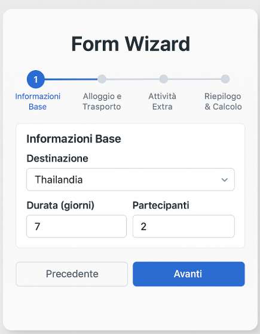

# aerei-carini

Progetto: frontend di un'agenzia viaggi
Realizzare l'interfaccia utente di un sito web per un'agenzia viaggi che permetta di:

- Esplorare pacchetti vacanza
- Richiedere preventivi
- Consultare offerte
- Navigare contenuti informativi (destinazioni, servizi, chi siamo, contatti)

Struttura generale del sito (sitemap):

- Homepage
- Destinazioni
- Pacchetti Viaggio
- Preventivatore (form wizard)
- Chi Siamo
- Contatti
- Offerte speciali / Last minute

Tecnologie:

- HTML5 – Struttura pagine
- CSS3 – Stile personalizzato
- Bootstrap 5 – Responsive design, layout a griglia e componenti
- JavaScript – Interattività base (moduli, toggle, filtri) e preventivatore
- Componenti chiave da sviluppare

1. Header e Navbar (Aurora)

   - Logo a sinistra
   - Navbar responsive con Bootstrap
   - Menu con le varie voci
   - Bottone “Richiedi Preventivo” evidenziato
     Hero Section (Homepage)

   - Sfondo con immagine/video ispirazionale
   - Testo motivazionale: “Scopri il viaggio dei tuoi sogni”
   - Call to action: “Esplora le offerte” + “Richiedi Preventivo”

2. Destinazioni (Antonio)

   - Griglia Bootstrap responsive (es. 3 colonne su desktop, 1 su mobile)
   - Card per ogni destinazione: immagine, nome, breve descrizione, bottone “Scopri”
   - Filtro JavaScript per continente o tipologia (mare, montagna, città, ecc.)

3. Pacchetti Viaggio (Carmine)

   - Lista pacchetti con card
   - Dettagli: titolo, descrizione, prezzo, durata, rating (stelle)
   - Pulsante “Dettagli” → popup/modal con info estese
   - Ordinamento JS (per prezzo, durata, ecc.)

4. Form Preventivo (wizard step-by-step) (Auro)
   - Seguire gli step come le immagini in allegato:  
     

Utilizzare: Progress bar Bootstrap + validazione JS
Il costo viene stabilito unicamente al primo step, sulla base di questi parametri: Parigi € 300, Roma € 100, Madrid € 200, Bangkok € 250.
Il costo viene poi moltiplicato per durata e partecipanti.
Es: scelgo Parigi, durata 2 giorni, 5 partecipanti (300x2x5).
Gli altri step non saranno utilizzati per calcolare il costo totale.

5. Chi Siamo (Marta)

   - Testo descrittivo + Timeline agenzia
   - Team: card con foto, nome, ruolo, social

6. Contatti (Antonio)

   - Modulo contatto con validazione JS
   - Mappa Google (embed)
   - Info: indirizzo, telefono, mail
   - Orari apertura

7. Footer (Marta)
   - Link utili (FAQ, Termini, Privacy)
   - Social media icons
   - Newsletter (input email + invia)

```css
/* CSS HEX */
--Caribbean Current: #006767;
--SGBUS green: #55DD33;
--sandy-brown: #fdad62ff;
--alice-blue: #ebf2faff;
```

PALETTE: https://coolors.co/022f40-0090c1-fdad62-ebf2fa
